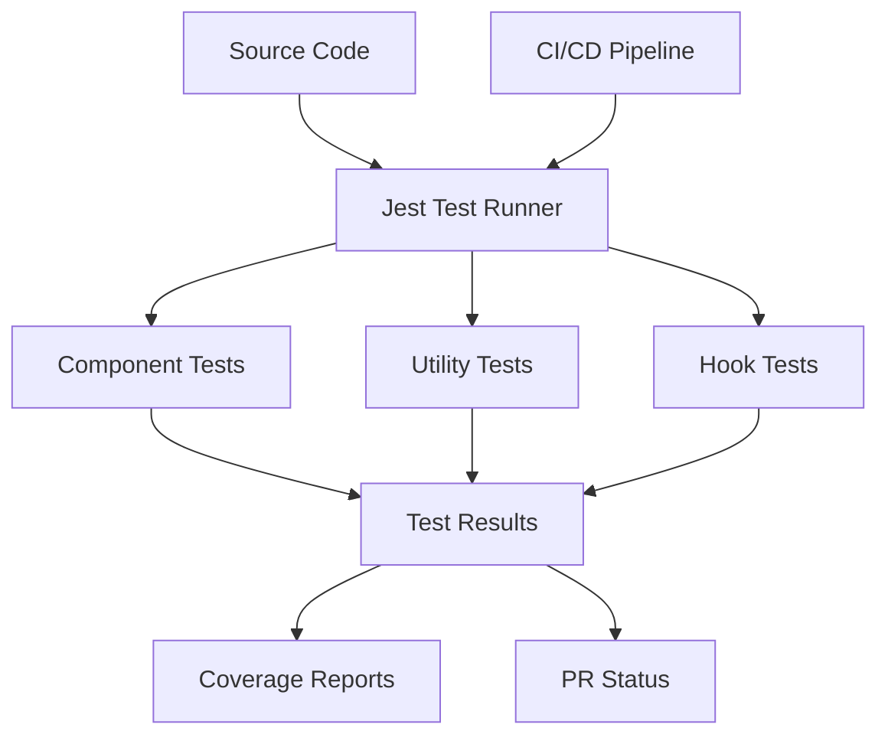

# Design Document: Unit Testing Implementation

## Overview

This design document outlines the approach for implementing comprehensive unit testing across the project. The implementation will focus on setting up Jest and React Testing Library as the primary testing frameworks, creating test utilities, establishing patterns for testing different types of components, and integrating testing into the development workflow.

## Architecture

The unit testing architecture will consist of the following components:

1. **Testing Framework**: Jest will serve as the primary test runner and assertion library, with React Testing Library for component testing.

2. **Test Structure**: Tests will be organized alongside the components they test, following a `[component-name].test.tsx` naming convention.

3. **Test Utilities**: Common testing utilities will be created to simplify test setup, mocking, and assertions.

4. **CI Integration**: Tests will be integrated into the CI/CD pipeline to run automatically on pull requests.



## Components and Interfaces

### Testing Framework Setup

The testing setup will include:

1. **Jest Configuration**:
   - Custom Jest configuration in `jest.config.js`
   - Setup files for global test environment
   - Transform configuration for TypeScript and other file types

2. **React Testing Library Setup**:
   - Custom render functions
   - User event simulation utilities
   - Common queries and assertions

3. **Test Utilities**:
   - Mock providers for context
   - Mock data generators
   - Common test fixtures

### Component Testing Patterns

Different types of components will require different testing approaches:

1. **UI Components**:
   - Render testing
   - Prop variation testing
   - Style and appearance testing
   - Accessibility testing

2. **Interactive Components**:
   - User event simulation
   - State change verification
   - Callback invocation testing

3. **Container Components**:
   - Integration with context or state
   - Data fetching mocking
   - Conditional rendering testing

### Utility Function Testing

Utility functions will be tested with:

1. **Input/Output Testing**:
   - Various input combinations
   - Expected output verification
   - Edge case handling

2. **Error Handling Testing**:
   - Error throwing conditions
   - Error recovery mechanisms

### Hook Testing

Custom hooks will be tested using:

1. **Hook Testing Library**:
   - State management verification
   - Effect execution testing
   - Callback behavior testing

## Data Models

### Test Data Models

Test data models will be created to represent:

1. **Mock User Data**:
   - Authentication states
   - User preferences
   - User roles and permissions

2. **Mock API Responses**:
   - Success responses
   - Error responses
   - Loading states

3. **Mock Component Props**:
   - Common prop combinations
   - Edge case prop values

### Test Result Models

Test results will be captured in:

1. **Coverage Reports**:
   - Statement coverage
   - Branch coverage
   - Function coverage
   - Line coverage

2. **Test Run Reports**:
   - Pass/fail status
   - Execution time
   - Error details

## Error Handling

The testing framework will handle errors in the following ways:

1. **Test Failures**:
   - Clear error messages
   - Stack traces
   - Diff views for assertion failures

2. **Test Setup Failures**:
   - Environment setup diagnostics
   - Dependency resolution errors
   - Configuration validation

3. **Mock Failures**:
   - Mock setup failure detection
   - Mock invocation verification
   - Mock reset mechanisms

## Testing Strategy

### Component Testing Strategy

1. **Render Testing**:
   - Verify components render without errors
   - Check for expected elements in the DOM
   - Verify accessibility attributes

2. **Interaction Testing**:
   - Simulate user events (clicks, inputs, etc.)
   - Verify state changes after interactions
   - Test form submissions and validations

3. **Integration Testing**:
   - Test component interactions with context
   - Test component interactions with hooks
   - Test component interactions with services

### Mocking Strategy

1. **API Mocking**:
   - Mock fetch/axios requests
   - Provide mock responses
   - Simulate network errors

2. **Context Mocking**:
   - Create mock context providers
   - Provide controlled context values
   - Test context updates

3. **Module Mocking**:
   - Mock imported modules
   - Mock specific module functions
   - Control module behavior

### Coverage Strategy

1. **Coverage Targets**:
   - Minimum 80% statement coverage
   - Minimum 70% branch coverage
   - Focus on critical path coverage

2. **Coverage Reporting**:
   - HTML reports for local development
   - CI integration for PR reviews
   - Trend analysis over time

## Implementation Details

### Directory Structure

```
├── __tests__/                  # Global test utilities and setup
│   ├── setup.ts                # Global test setup
│   ├── test-utils.tsx          # Common test utilities
│   └── mocks/                  # Common mocks
│       ├── handlers.ts         # MSW request handlers
│       └── server.ts           # MSW server setup
├── components/
│   ├── component-name.tsx      # Component source
│   └── component-name.test.tsx # Component tests
├── lib/
│   ├── util-name.ts            # Utility source
│   └── util-name.test.ts       # Utility tests
├── jest.config.js              # Jest configuration
└── tsconfig.test.json          # TypeScript config for tests
```

### Test File Structure

Each test file will follow a consistent structure:

```typescript
// Import dependencies
import { render, screen } from '@testing-library/react'
import userEvent from '@testing-library/user-event'
import { ComponentName } from './component-name'

// Optional test setup
const setup = (props = {}) => {
  return render(<ComponentName {...props} />)
}

// Test suite
describe('ComponentName', () => {
  // Individual tests
  it('renders without errors', () => {
    setup()
    expect(screen.getByRole('button')).toBeInTheDocument()
  })

  it('handles user interactions', async () => {
    setup()
    await userEvent.click(screen.getByRole('button'))
    expect(screen.getByText('Clicked')).toBeInTheDocument()
  })
})
```

### Mock Implementation

For mocking external dependencies:

```typescript
// Mock module
jest.mock('@/lib/api', () => ({
  fetchData: jest.fn().mockResolvedValue({ data: 'mocked data' })
}))

// Mock context
const mockContextValue = {
  user: { id: '1', name: 'Test User' },
  isAuthenticated: true
}

const wrapper = ({ children }) => (
  <AuthContext.Provider value={mockContextValue}>
    {children}
  </AuthContext.Provider>
)

render(<ComponentUsingAuth />, { wrapper })
```

### CI Integration

The CI pipeline will be configured to:

1. Run tests on every PR
2. Generate and report coverage
3. Fail the build if tests fail or coverage is below thresholds

```yaml
# Example GitHub Actions workflow
name: Run Tests
on: [pull_request]
jobs:
  test:
    runs-on: ubuntu-latest
    steps:
      - uses: actions/checkout@v3
      - uses: actions/setup-node@v3
        with:
          node-version: '18'
      - run: npm ci
      - run: npm test
      - name: Upload coverage
        uses: codecov/codecov-action@v3
```